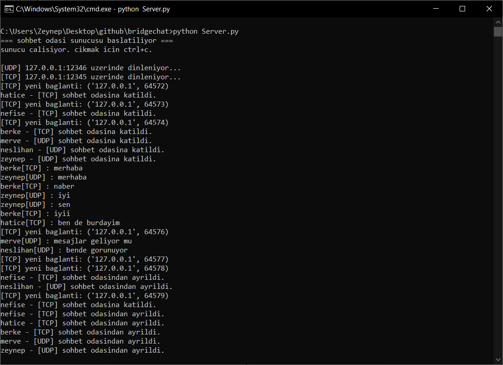
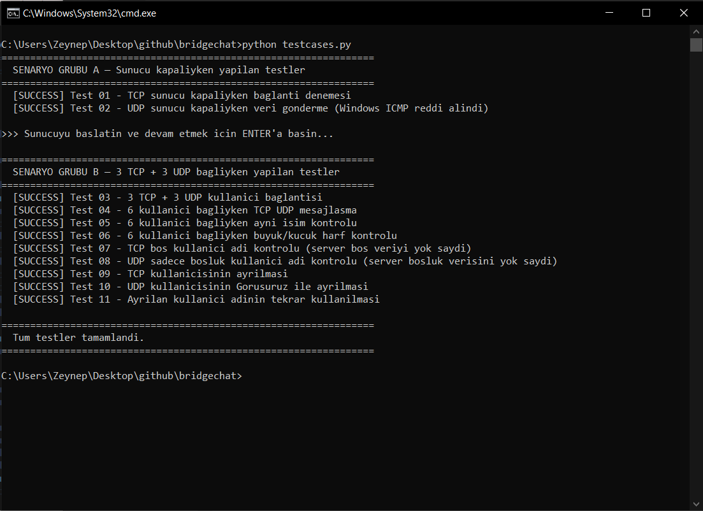

<div align="center">

# 🌉 BridgeChat

**A multi-protocol chat room where TCP and UDP clients talk to each other — in the same room.**


</div>

---

## 📌 About

BridgeChat is a terminal-based chat room server built with Python's `socket` and `threading` libraries. It accepts both TCP and UDP clients simultaneously, broadcasting messages across all connected users regardless of which protocol they used to connect.

The project was developed as a Computer Networks (BIL302) assignment and demonstrates practical use of socket programming, concurrent client handling, and protocol-agnostic messaging.

---

## ✨ Features

- **Dual-protocol support** — TCP and UDP clients coexist in the same chat room
- **Multi-threaded server** — each TCP client runs in its own thread; UDP is handled in a single dedicated thread
- **Cross-protocol broadcast** — a message from a TCP client is delivered to all UDP clients and vice versa
- **Username uniqueness** — duplicate usernames are rejected across both protocols
- **Case-insensitive validation** — `Nefise` and `NEFISE` are treated as the same user
- **Graceful disconnection** — TCP clients are detected when their socket closes; UDP clients send `Gorusuruz` to leave
- **Username reuse** — once a user leaves, their username becomes available again

---

## 🗂️ Project Structure

```
bridgechat/
├── Server.py       # Main server — handles TCP and UDP listeners
├── ClientTCP.py    # TCP client
├── ClientUDP.py    # UDP client
├── testcases.py    # Automated test suite (11 tests, 2 scenario groups)
└── assets/
    ├── server.png
    └── testcases.png
```

---

## ⚙️ How It Works

### Server (`Server.py`)

The server starts two listener threads on launch:

- **TCP Listener** (`127.0.0.1:12345`) — accepts incoming connections, spawns a new thread per client via `handle_tcp_client()`
- **UDP Listener** (`127.0.0.1:12346`) — processes all datagrams in a single thread; the first datagram from any new address is treated as the username

Both listeners share a `broadcast()` function that delivers messages to all connected clients across both protocols. A `threading.Lock` protects the shared `tcp_clients` and `udp_clients` dictionaries.

### TCP Client (`ClientTCP.py`)

Connects to the server, completes username registration, then starts a background listener thread. The main thread handles user input and sends messages.

### UDP Client (`ClientUDP.py`)

No persistent connection — the OS assigns a port automatically. The first datagram sent is the username. Subsequent messages are broadcast to the room. Typing `Gorusuruz` signals the server to remove the user.

---

## 🚀 Running the Project

**1. Start the server:**
```bash
python Server.py
```

**2. Open a TCP client (one or more terminals):**
```bash
python ClientTCP.py
```

**3. Open a UDP client (one or more terminals):**
```bash
python ClientUDP.py
```

Enter your username when prompted. Messages sent from any client will appear in all other connected clients' terminals, tagged with the sender's name and protocol (e.g., `berke[TCP] : merhaba`, `zeynep[UDP] : merhaba`).

To leave: TCP clients can close their terminal (Ctrl+C), UDP clients type `Gorusuruz`.

---

## 🧪 Test Scenarios

The test suite (`testcases.py`) is split into two scenario groups and covers 11 tests in total.

**Run:**
```bash
python testcases.py
```

When prompted, start the server in a separate terminal and press Enter to continue.

---

### Group A — Server Offline Tests

| # | Test | Expected Behaviour |
|---|------|--------------------|
| 01 | TCP connection attempt while server is offline | `ConnectionRefusedError` raised |
| 02 | UDP datagram sent while server is offline | Timeout or Windows ICMP rejection |

---

### Group B — 3 TCP + 3 UDP Clients Connected

These tests use six simultaneous clients:

| Protocol | Usernames |
|----------|-----------|
| TCP | hatice, nefise, berke |
| UDP | merve, neslihan, zeynep |

| # | Test | Expected Behaviour |
|---|------|--------------------|
| 03 | Connect all six clients | All receive `Hosgeldiniz` |
| 04 | Cross-protocol messaging (TCP ↔ UDP) | Messages reach all other clients |
| 05 | Duplicate username attempt | Server rejects with "zaten sohbet odasında" |
| 06 | Case-insensitive duplicate (`NEFISE` while `nefise` is online) | Server rejects the duplicate |
| 07 | Empty username via TCP | Server ignores or rejects |
| 08 | Whitespace-only username via UDP | Server ignores or rejects |
| 09 | TCP client disconnect (nefise closes socket) | Server removes user, broadcasts departure |
| 10 | UDP client leaves with `Gorusuruz` (neslihan) | Server removes user, broadcasts departure |
| 11 | Reuse of departed username (`nefise` reconnects) | `Hosgeldiniz` — username is available again |

---

## 📸 Screenshots

### Server Console



*Server output showing six clients joining, chatting across protocols, and disconnecting.*

---

### Test Results



*All 11 tests passing across both scenario groups.*

---

## 🔧 Technical Notes

- The server uses `SO_REUSEADDR` so it can restart without waiting for the OS to release the port.
- UDP does not have a native disconnect mechanism — the `Gorusuruz` keyword serves as an application-level leave signal.
- On Windows, closing a UDP socket may generate a WinError 10054 (ICMP port unreachable); the server handles this silently.
- The `lock` object wraps all reads and writes to the shared client dictionaries to prevent race conditions under concurrent access.

---

## 📋 Requirements

- Python 3.x
- No external libraries — only the standard `socket` and `threading` modules

---

> *TCP delivers your messages reliably. UDP delivers your emotions. BridgeChat handles both.* 

---

<div align="center">

**BIL302 — Computer Networks Assignment**

⭐ Star this repo if you find it helpful!

*Made with ❤️ by [zeynpakn](https://github.com/zeynpakn)*


</div>
